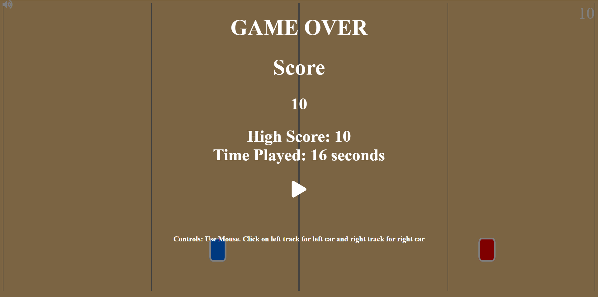
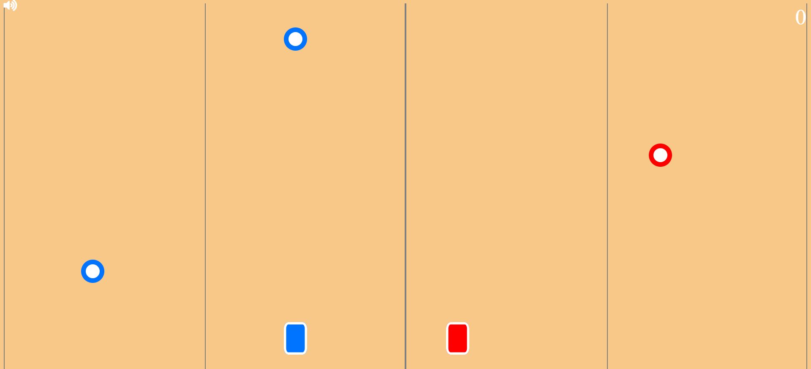
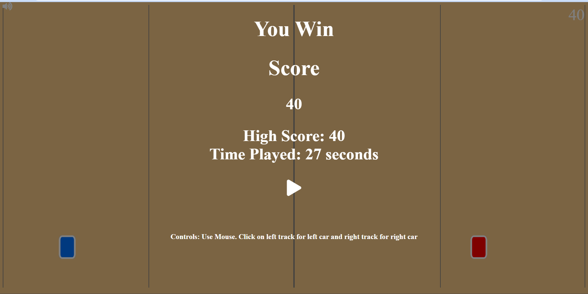

You can play the game 2 CARS HERE: https://2cars.surge.sh/ 

[click here](https://2cars.surge.sh/)

This is a Hard game to Play. You will need to maneuver both the cars at the same time.
The Game will run for a total of 10 minutes. If you survive You Win!!
Avoid the squares and collect all the circles.
If you miss a circle the game is over. If you hit a square the game is over.

Bonus:

A triangle shape appears after you reach score 20.
I you collect a triangle you will get 5 points instead of 1.
If you miss a triangle you will not die. The game will still go on.
You will need to collect a total 100 triangles. if you collect all of them you win the game. (This is very tough to achieve in 10 minutes. Try your luck!!)

The game can be played with the Mouse. Tap on either tracks to move the cars. You can also play the game with the keyboard. Use key Z and M to move the left and the right car respectively.

The metric tracked and stored in local storage is the Time Played by the user. it is also displayed along side the highscore. the high score is also stored in the locat storage.

The Dynamic part is that the speed of the Game will increase when the score is increased.

Screenshots:

